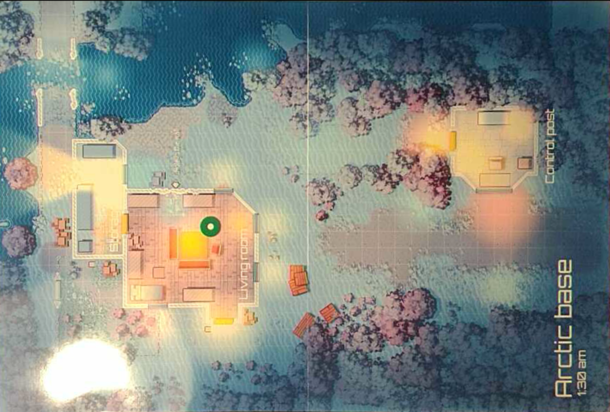

# OpenCV experiments

## OpenCV tutorial

<https://opencv-python-tutroals.readthedocs.io/en/latest/py_tutorials/py_feature2d/py_matcher/py_matcher.html>

## Images

### Template

PNG with transparency

### Frame

Map taken from here <https://deepnight.net/tools/rpg-map/#&gid=1&pid=4>

This is not the original image. It's a projection taken from a camera picture that is already processed to have perspective transformation and rescaling to the original map dimension.

We also have some shadows/reflections of lamps in my room.
